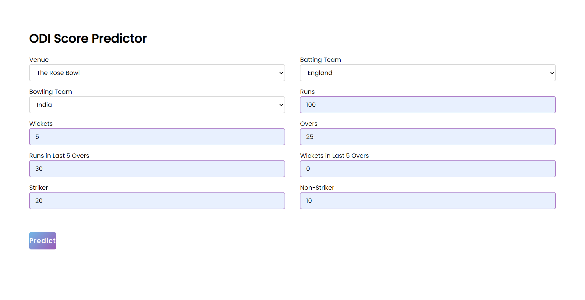
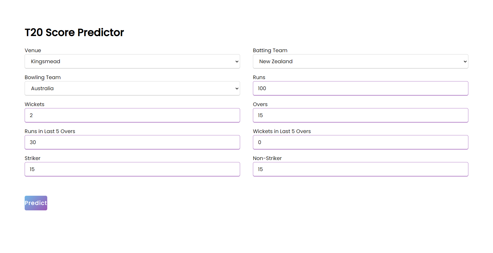

# Cricket Score Predictor

This repository contains a machine learning model designed to predict the outcome of cricket matches. It uses various features from past matches to predict scores for both One-Day Internationals (ODIs) and T20s.

## Files Included

### Screenshots:





These screenshots provide visualizations of the predicted results and performance metrics for both ODIs and T20 matches.

### Dummy Text:
- **dummy.txt**: This file contains dummy data used for testing the functionality of the project.

## Project Setup

1. **Clone the repository:**

   ```bash
   git clone https://github.com/Abhip32/Cricket-Score-Predictor.git
   ```

2. **Install the required dependencies:**

   You can install all the required dependencies using the following command:

   ```bash
   pip install -r requirements.txt
   ```

3. **Run the script:**

   Once the dependencies are installed, you can run the main script for predicting the cricket match results.

   ```bash
   python main.py
   ```

   Make sure that you have the relevant data files available in the project folder to run the model.

## Features

- Predicts scores for ODIs and T20 matches.
- Includes visualizations and analysis of results.
- Provides a user-friendly interface to input match data and get predictions.


